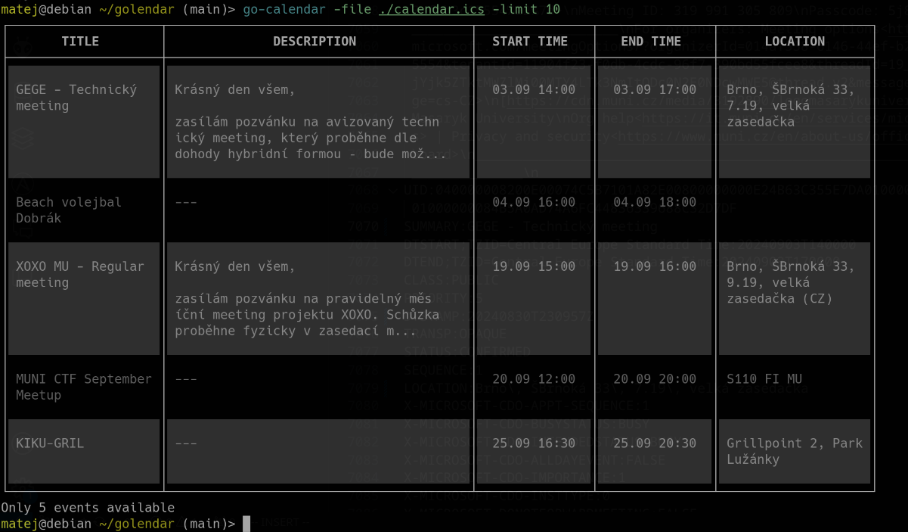

# Go-Calendar

Simple TUI calendar written in Go using the [libgloss](https://github.com/charmbracelet/lipgloss) library.

Go-Calendar reads an ICS file from a URL and displays the upcoming events in a table view.

The ICS file can be from any calendar application that supports exporting to ICS. The format and structure of ICS files are specified in [RFC 5545](https://tools.ietf.org/html/rfc5545) and are used by many calendar applications like Google Calendar, Apple Calendar, or Microsoft Outlook and others.



## Installation

```bash
go mod download
go build
sudo cp go-calendar /usr/local/bin
```

## Usage

```bash
Usage of go-calendar:
  -file string
    	File to read the events from
  -limit int
    	Number of events to display (default 5)
  -url string
    	URL to download the events
```

### Example

```bash
URL=https://calendar.google.com/calendar/ical/.../basic.ics
go-calendar -url $URL -limit 7
# or
go-calendar -file events.ics -limit 1
```

## Calendar integration

### Outlook

1. Open Outlook and go settings
2. Click on "Calendar" in the left sidebar
3. Click on "Shared Calendars" and select the calendar you want to share
4. Publish the calendar by clicking on "Publish Online" and copy the ICS link
5. Use the ICS link in the `URL` environment variable

## Terminal integration

### Fish

To make your calendar appear on startup of a new shell without having to wait.

1. `vim ~/.config/fish/config.fish`
2. Add following code to the conf.

```
function fish_greeting
    export URL="https://outlook.office365.com/calendar.ics"
    go-calendar -file /tmp/calendar.ics
    curl $URL > /tmp/calendar.ics 2>/dev/null &
end
```
